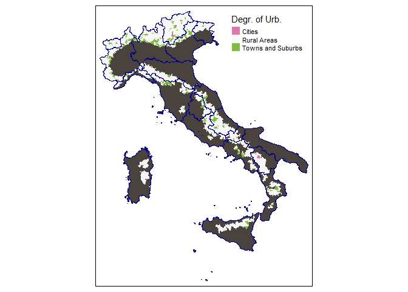

Italian highlanders, who are they?
================
Diana
2023-01-30

For this study dataset “Mappa dei rischi dei comuni italiani” and shape
file of italian boarders were used, that are openly published at ISTAT
website. <https://www.istat.it/it/mappa-rischi>
<https://www.istat.it/it/archivio/222527>

Reading the prepared data. Data was prepared using the file
“data_cleaning_and_merging.R”.

Including all necessary libraries.

    ## Warning: пакет 'raster' был собран под R версии 4.2.2

    ## Загрузка требуемого пакета: sp

    ## ── Attaching packages ─────────────────────────────────────── tidyverse 1.3.2 ──
    ## ✔ ggplot2 3.3.6      ✔ purrr   0.3.5 
    ## ✔ tibble  3.1.8      ✔ dplyr   1.0.10
    ## ✔ tidyr   1.2.1      ✔ stringr 1.4.1 
    ## ✔ readr   2.1.3      ✔ forcats 0.5.2 
    ## ── Conflicts ────────────────────────────────────────── tidyverse_conflicts() ──
    ## ✖ tidyr::extract() masks raster::extract()
    ## ✖ dplyr::filter()  masks stats::filter()
    ## ✖ dplyr::lag()     masks stats::lag()
    ## ✖ dplyr::select()  masks raster::select()

    ## Warning: пакет 'sf' был собран под R версии 4.2.2

    ## Linking to GEOS 3.9.3, GDAL 3.5.2, PROJ 8.2.1; sf_use_s2() is TRUE

    ## Warning: пакет 'maps' был собран под R версии 4.2.2

    ## 
    ## Присоединяю пакет: 'maps'
    ## 
    ## Следующий объект скрыт от 'package:purrr':
    ## 
    ##     map

    ## Warning: пакет 'spData' был собран под R версии 4.2.2

    ## To access larger datasets in this package, install the spDataLarge
    ## package with: `install.packages('spDataLarge',
    ## repos='https://nowosad.github.io/drat/', type='source')`
    ## Linking to ImageMagick 6.9.12.3
    ## Enabled features: cairo, freetype, fftw, ghostscript, heic, lcms, pango, raw, rsvg, webp
    ## Disabled features: fontconfig, x11

    ## Warning: пакет 'tmap' был собран под R версии 4.2.2

    ## Загрузка требуемого пакета: viridisLite
    ## 
    ## Присоединяю пакет: 'viridis'
    ## 
    ## Следующий объект скрыт от 'package:maps':
    ## 
    ##     unemp
    ## 
    ## 
    ## Присоединяю пакет: 'reshape2'
    ## 
    ## Следующий объект скрыт от 'package:tidyr':
    ## 
    ##     smiths

    ## Warning: пакет 'ggridges' был собран под R версии 4.2.2

    ## corrplot 0.92 loaded
    ## Registered S3 method overwritten by 'GGally':
    ##   method from   
    ##   +.gg   ggplot2

“MdR” dataset is providing Altitude zones classifying italian
munitipalities into 5 cathegories: - “Pianura – Lowlands”, - “Collina
Litoranea – Hills, touching seacost”, - “Collina interna – Hills, not
touching seacost”, - “Montagna litoranea – Mountainsm touching
seacost”, - “Montagna Interna – mountains area that don’t touch any sea
coast”.

<!-- --> As we
may see, the prevalence of “Rural areas” in the comunes belonging to
“Montagna interna” class is higher than in all other altitude zones
classes. This class has a tiny percent of cities which are

``` r
data[(data$ZONA_ALT_TXT=="Montagna interna")&(data$DEGREE_URB_TXT=="Cities"),c("DZREG","DZCOM","POP_2018")]
```

    ##                             DZREG         DZCOM POP_2018
    ## 2675 Trentino-Alto Adige/Südtirol Bolzano/Bozen   107317
    ## 2927 Trentino-Alto Adige/Südtirol        Trento   117997
    ## 5788                       Molise    Campobasso    49262
    ## 6177                   Basilicata       Potenza    67211
    ## 7453                    Lombardia         Lecco    48177

That is interesting. Let’s see to which class L’Aquila, Perugia, Como
are classified:

``` r
data[data$DZCOM %in% c("Como","Perugia","L'Aquila"),c("DZCOM","ZONA_ALT_TXT","DEGREE_URB_TXT","POP_2018")]
```

    ##         DZCOM     ZONA_ALT_TXT    DEGREE_URB_TXT POP_2018
    ## 1538     Como  Collina interna            Cities    83320
    ## 4496  Perugia  Collina interna            Cities   165683
    ## 5526 L'Aquila Montagna interna Towns and Suburbs    69439

Suprisingly, but L’Aquila is not classified as City in this dataset,
though it is a capital of region Abruzzo.

``` r
tm_shape(comunesmerged) +
  tm_fill(col = "ZONA_ALT_TXT", title = "Altitude zone", palette="Dark2") + tm_shape(regions)+tm_borders()
```

<!-- -->

We see, that Valle d’Aosta and Trentino-Alto Adige/Südtirol Regions
contain only comunes that are classified as “Montagna Interna”. For
Lombardy, Friuli-Venezia Giulia, Abruzzo, Molise, Basilicata mountains
take almost half of the territory. In all the regions there are
“Internal Mountains” part, except of Apulia, that is located at the
“hill of the boot”. In the “Seacost mountains”, as one may guess, people
are motivated to live, because the presence of the sea brings money and
tourists. But we are interested in “Internal Mountains”, and see, which
motivation drives people to live there. So we would concentrate only on
“Internal Mountains” part and would select it from the dataset.

``` r
comunesMtIn<-comunesmerged[comunesmerged$ZONA_ALT_TXT=="Montagna interna",]
comunesMtIn<-comunesMtIn[comunesMtIn$DEGREE_URB_TXT!="--",]
comunesMtIn$DEGREE_URB_TXT<-droplevels(comunesMtIn$DEGREE_URB_TXT)
comunesMtIn <- comunesMtIn[!st_is_empty(comunesMtIn), ]
```

Let’s see where the comunes, classified as “cities, towns and suburbs”
in “Montagna interna” are located.

``` r
tm_shape(comunesmerged)+tm_fill(col="#49423d")+tm_shape(comunesMtIn)+tm_fill(col="DEGREE_URB_TXT",title = "Degr. of Urb.",palette="PiYG")+tm_shape(regions)+tm_borders(col = "darkblue")
```

<!-- -->
Interesting, that in Molise and Basilicata “Towns and Suburbs” are not
concentrated around Cities, which usually happens. Basicata region even
doesn’t have comunes that are classified as “Towns and Suburbs”.

``` r
tm_shape(comunesmerged)+tm_fill(col="#49423d")+tm_shape(comunesMtIn)+tm_fill(col="ALT_LOC_AB",title="highest inhabited area",palette = "YlOrRd")+tm_shape(regions)+tm_borders(col = "darkgreen")
```

<!-- --> As we
may see in the graph above, the altitude is not the explanation of the
phenomenon that in the south the cities are not surrounded by “towns and
suburbs”. In Basilicata and Molise the surrounding areas are on the same
range of altitudes than the cities.

``` r
tm_shape(comunesmerged)+tm_fill(col="#49423d")+tm_shape(comunesMtIn)+tm_bubbles(size ="POP_2018",col="POP_2018")+tm_shape(regions)+tm_borders(col = "darkgreen")
```

    ## Legend labels were too wide. Therefore, legend.text.size has been set to 0.55. Increase legend.width (argument of tm_layout) to make the legend wider and therefore the labels larger.

<!-- --> On
the graph which represents the population by municipality, it is
noticeable that some comunes have a significant population, but are not
called cities. For example, in Toscana.

``` r
data[(data$ZONA_ALT_TXT=="Montagna interna")&(data$POP_2018>=50000)&(data$DEGREE_URB_TXT!="Cities"),c("DZREG","DZCOM","POP_2018")]
```

    ##        DZREG    DZCOM POP_2018
    ## 4252 Toscana  Pistoia    90195
    ## 4475  Umbria  Foligno    56999
    ## 5526 Abruzzo L'Aquila    69439

It would be interesting to know, when which areas were populated.

``` r
dataMt<-data[data$ZONA_ALT_TXT=="Montagna interna",]
dataMt<-dataMt %>% 
  rename(
    `<1919` = ERE8 ,
    `1919-1945` = ERE9,
    `1946-1960`= ERE10 ,
    `1961-1970`= ERE11,
    `1971-1980`= ERE12,
    `1981-1990`= ERE13,
    `1991-2000`= ERE14,
    `2001-2005`= ERE15,
    `2005 and after`=ERE16

    )
```

``` r
periods<-melt(dataMt[,c('<1919','1919-1945','1946-1960','1961-1970','1971-1980','1981-1990','1991-2000','2001-2005','2005 and after')])     
```

    ## No id variables; using all as measure variables

``` r
names(periods)<-c("period","percents")
```

``` r
ggplot(periods, aes(x = percents, y = period, fill = ..x..)) +
  geom_density_ridges_gradient(scale = 3, rel_min_height = 0.01) +
  scale_fill_viridis(name = "percents", option = "C") +
  labs(title = 'percent') +
    theme(
      legend.position="none",
      panel.spacing = unit(0.1, "lines"),
      strip.text.x = element_text(size = 8)
    )
```

    ## Picking joint bandwidth of 1.33

<!-- --> In
some of municipalities percent of buildings that were built in 1919 that
are used for living is more than 50%. Percent of new built buildings is
only slightly overcoming 15%. Maybe there are some outliers, but they
are not shown on this graph.

``` r
periodsmatrix<-comunesMtIn[,c('ERE8','ERE9','ERE10','ERE11','ERE12','ERE13','ERE14','ERE15','ERE16')]
periodsmatrix$geometry<-c()
vecind<-max.col(periodsmatrix, ties.method = "random")
yearsstring<-c('<1919','1919-1945','1946-1960','1961-1970','1971-1980','1981-1990','1991-2000','2001-2005','2005 and after')
comunesMtIn$periods<-yearsstring[vecind]
```

``` r
tm_shape(comunesmerged)+tm_fill(col="#49423d")+tm_shape(comunesMtIn)+tm_fill(col="periods",palette = "PiYG")+tm_shape(regions)+tm_borders(col = "darkblue")
```

<!-- --> The
graph shows that in most of the comunes the buildings that were built
before 1919 still used the most. Only in several regions we see the
different situation. We see area shared by Basilicata and Campania
(probably because of the earthquake in 1980) where the inhabitated
buildings of 80s are dominating, same for Friuli-Venezia-Giulia
(probably because of the earthquake in 1976). There are a lot of new
houses in Alto Adige, Valle d’Aosta. In Abruzzo, the L’Aquila is
standing odd, there are a lot of new residential houses. It can be
explained by the rebuilding of the buildings, destroyed by the
earthquake in 2009. Same applies to the minicupalities in Umbria. In
Umbria several very stron earthquakes happened in 1997, 1984,1979.

The big amount of modern buildings in the north regions can be explained
that people want to live near the boarder with Austria or Switzerland
and work in these countries, each day returning back to Italy (pendulum
workers), that is relatively popular among people who are living in the
north regions of Italy.

``` r
tm_shape(comunesmerged)+tm_fill(col="#49423d")+tm_shape(comunesMtIn)+tm_fill(col="VAR_PERC",title="Pop. var. %",palette = "-RdYlBu")+tm_shape(regions)+tm_borders(col = "darkblue")
```

    ## Variable(s) "VAR_PERC" contains positive and negative values, so midpoint is set to 0. Set midpoint = NA to show the full spectrum of the color palette.

<!-- --> As
expected, one may observe movement of people to the areas, which are
close to boarders with Austria and Switzerland and from the periferical
comunes to comunes with already high population. For example L’Aquila in
Abruzzo and Pistoia in Toscana. We see smaller positive movevent of
population to the areas that are near to the boarders with France, but
it is also present.

``` r
dataMt$A3A2<-dataMt$A3/(dataMt$A2/100)
dataMt$SUPRAT<-dataMt$SUP_URB/(dataMt$SUP/100)
ggpairs(dataMt[,c("A3A2","ALT_LOC_AB","SUPRAT","PAI_AREAAA")]) 
```

<!-- -->

A7A2 – coefficient, representing the percent of houses and flats that
are owned by people that are actually living in those houses in the
total number of houses and flats. ALT_LOC_AB – a hight of the highest
inhabited area in a munitipality SUPRAT – percent of the effectively
used areas of a munitipality to its total occupited area. PAI_AREAAA –
area of a minitipality that is suspected to be subject to a risk of
seismological or other types of natural hazard. As one can observe,
there is no correlation between the sizes of areas with the risk of
hazard and the amount of people actually living in the comunes.
